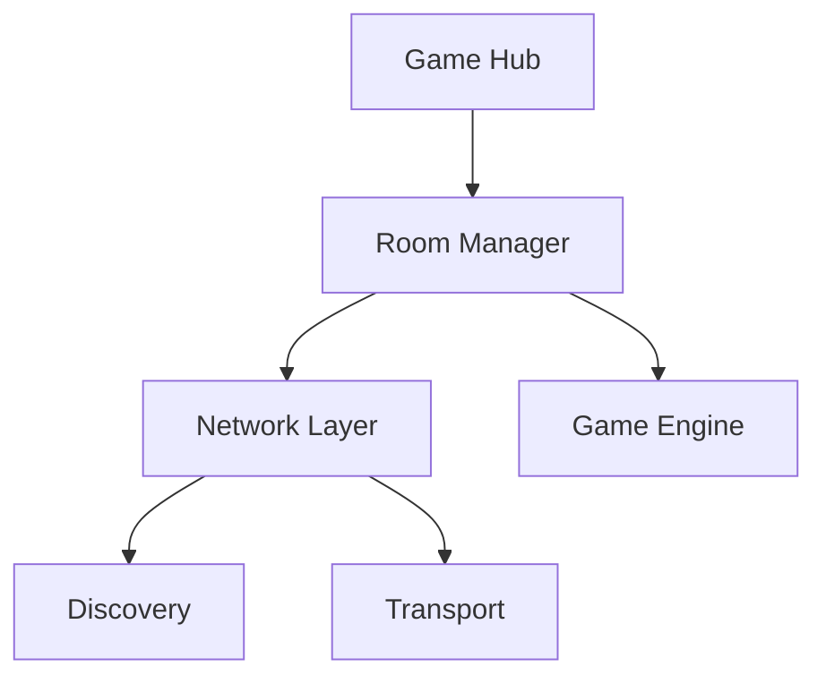

# Game Platform Development Workflow

## 1. Mục tiêu

Workflow này dùng để phát triển một nền tảng game đối kháng nhiều người, trong đó:

- Người dùng có thể chọn nhiều game khác nhau.
- Người dùng có thể tạo Room.
- Người chơi khác có thể tìm và tham gia Room.
- Kết nối ưu tiên sử dụng Wi-Fi/LAN.
- Không yêu cầu Internet trong MVP.
- Hỗ trợ Android và iOS.
- Kiến trúc Networking độc lập với Game Logic.
- Room System là thành phần dùng chung cho tất cả game.
- Game đầu tiên dùng để validate platform là Tic-Tac-Toe.
- Sau khi platform ổn định, các game tiếp theo phải tái sử dụng Room System và Network Layer.

---

# 2. Nguyên tắc kiến trúc

## 2.1. Game không được quản lý connection

Game chỉ xử lý:

- Game State
- Player
- Turn
- Action
- Rule
- Win/Lose/Draw
- Game Result

Game không được trực tiếp xử lý:

- Wi-Fi discovery
- IP address
- Socket
- WebSocket
- WebRTC
- Bluetooth
- Connection lifecycle

Ví dụ:

```text
Game
  ↓
Game Action
  ↓
Network Layer
```

Không được:

```text
Game
  ↓
Socket
  ↓
Wi-Fi
```

---

# 3. Các tầng chính

Platform được chia thành các tầng:

```text
┌───────────────────────────────┐
│           GAME HUB            │
│                               │
│ Game List / Home / Navigation │
└───────────────┬───────────────┘
                │
┌───────────────▼───────────────┐
│         ROOM MANAGER          │
│                               │
│ Create / Discover / Join      │
│ Leave / Start / Finish        │
└───────────────┬───────────────┘
                │
┌───────────────▼───────────────┐
│        NETWORK LAYER          │
│                               │
│ Discovery                     │
│ Connection                    │
│ Messaging                     │
│ Heartbeat                     │
│ Disconnect                    │
└───────────────┬───────────────┘
                │
┌───────────────▼───────────────┐
│         GAME SESSION          │
│                               │
│ Players / State / Lifecycle   │
└───────────────┬───────────────┘
                │
        ┌───────┼────────┐
        │       │        │
        ▼       ▼        ▼
      X-O     Chess    Game #3
```

---

# 4. Development phases

Workflow gồm các phase:

```text
DISCOVER
   ↓
PRODUCT DESIGN
   ↓
UX FLOW
   ↓
UI DESIGN
   ↓
ARCHITECTURE
   ↓
TECH SPIKE
   ↓
MVP PLANNING
   ↓
IMPLEMENTATION
   ↓
MULTI-DEVICE TEST
   ↓
REVIEW
   ↓
RELEASE
   ↓
NEXT GAME
```

Không được bỏ qua `TECH SPIKE` trước khi khóa Networking Architecture.

---

# 5. Phase 01 — DISCOVER

## Mục tiêu

Xác định platform cần xây dựng là gì trước khi quyết định framework hoặc code.

## Cần xác định

### Product

- Platform dành cho loại game nào?
- Game đối kháng bao nhiêu người?
- Người chơi có cần account không?
- Có cần nickname không?
- Có cần avatar không?
- Có cần lịch sử trận đấu không?

### Room

- Ai tạo Room?
- Room có tối đa bao nhiêu người?
- Room có password không?
- Room có Room Code không?
- Room có tự động đóng không?
- Host rời Room thì chuyện gì xảy ra?

### Connection

MVP:

```text
Android ↔ Android
iOS ↔ iOS
Android ↔ iOS
```

Ưu tiên:

```text
Wi-Fi / LAN
```

Không yêu cầu:

```text
Internet
Cloud Server
Account Server
```

trong MVP.

## Output

Tạo:

```text
docs/product/product-brief.md
```

File phải trả lời được:

```text
Platform là gì?
Người dùng là ai?
Game đầu tiên là gì?
Room hoạt động thế nào?
MVP bao gồm những gì?
MVP không bao gồm những gì?
```

---

# 6. Phase 02 — PRODUCT DESIGN

## Mục tiêu

Thiết kế lifecycle của Platform và Room.

## Room lifecycle

Phải định nghĩa rõ:

```text
NONE
  ↓
CREATING
  ↓
WAITING
  ↓
READY
  ↓
PLAYING
  ↓
FINISHED
  ↓
CLOSED
```

Ví dụ:

```text
Create Room
    ↓
Waiting for Player
    ↓
Player Joined
    ↓
Ready
    ↓
Game Started
    ↓
Playing
    ↓
Game Finished
    ↓
Room Closed
```

## Player lifecycle

```text
DISCOVERED
    ↓
CONNECTED
    ↓
JOINED
    ↓
READY
    ↓
PLAYING
    ↓
DISCONNECTED
```

## Output

```text
docs/product/room-lifecycle.md
docs/product/player-lifecycle.md
```

---

# 7. Phase 03 — UX FLOW

## Mục tiêu

Thiết kế toàn bộ user flow trước khi code UI.

Sử dụng:

- FigJam cho flow.
- Figma cho UI screen.

## Flow chính

### Home

```text
Home
 ↓
Game List
 ↓
Select Game
```

### Create Room

```text
Select Game
 ↓
Create Room
 ↓
Room Created
 ↓
Waiting
 ↓
Player Joined
 ↓
Start Game
```

### Join Room

```text
Select Game
 ↓
Find Rooms
 ↓
Select Room
 ↓
Join
 ↓
Waiting
 ↓
Game Started
```

### Game

```text
Game Started
 ↓
Player Turn
 ↓
Game Action
 ↓
Opponent Action
 ↓
Game State Update
 ↓
Game Finished
```

### Disconnect

Phải thiết kế:

```text
Player disconnects
       ↓
Detect disconnect
       ↓
Notify remaining player
       ↓
Handle Room
       ↓
Return to Room/Home
```

## Output

```text
docs/ux/user-flow.md
docs/ux/room-flow.md
docs/ux/game-flow.md
```

Figma/FigJam là source cho UI/UX, nhưng các flow quan trọng phải được mô tả lại bằng Markdown để Claude Code có thể đọc được trong repository.

---

# 8. Phase 04 — UI DESIGN

## Mục tiêu

Thiết kế UI có thể tái sử dụng giữa nhiều game.

## Các màn hình platform

Tối thiểu:

```text
Splash
Home
Game List
Game Detail
Create Room
Room Browser
Join Room
Waiting Room
Game
Game Result
Settings
```

## Không thiết kế riêng Room cho từng game

Sai:

```text
Tic-Tac-Toe Room
Chess Room
Game C Room
```

Đúng:

```text
Generic Room
    +
Game Metadata
```

Ví dụ:

```json
{
  "gameId": "tic-tac-toe",
  "gameName": "Tic-Tac-Toe",
  "players": 1,
  "maxPlayers": 2,
  "status": "waiting"
}
```

---

# 9. Phase 05 — ARCHITECTURE

## Mục tiêu

Thiết kế architecture trước implementation.

## Các module bắt buộc

```text
GameHub
RoomManager
NetworkManager
DiscoveryService
ConnectionManager
MessageTransport
GameSession
GameRegistry
GameEngine
```

## Game Registry

Game phải được đăng ký thông qua abstraction.

Ví dụ:

```text
GameRegistry
    │
    ├── tic-tac-toe
    ├── chess
    └── connect-four
```

Room chỉ lưu:

```text
gameId
```

Không hard-code:

```text
if game == tic-tac-toe
```

trong Room Manager.

---

# 10. Network Architecture

## Network Layer phải có abstraction

API logic tối thiểu:

```text
discoverRooms()
createRoom()
joinRoom()
leaveRoom()

connect()
disconnect()

send()
broadcast()

onMessage()
onPlayerJoined()
onPlayerLeft()
onConnected()
onDisconnected()
```

Game không được gọi trực tiếp implementation cụ thể.

---

# 11. Transport abstraction

Kiến trúc phải cho phép:

```text
Network API
    │
    ├── LAN
    │
    ├── WebRTC
    │
    └── Future Transport
```

MVP ưu tiên:

```text
LAN / Wi-Fi
```

Không được thiết kế architecture chỉ hoạt động với một transport nếu việc đó gây khó khăn cho việc bổ sung transport khác sau này.

---

# 12. Host / Client Model

MVP sử dụng mô hình:

```text
             HOST
              │
       ┌──────┴──────┐
       │ Game State  │
       └──────┬──────┘
              │
       ┌──────┴──────┐
       │             │
   Player A       Player B
```

Host chịu trách nhiệm:

- Validate action.
- Maintain authoritative state.
- Broadcast state.
- Xác định game result.
- Quản lý player lifecycle.

Client không được tự quyết định kết quả cuối cùng.

---

# 13. Game Protocol

Tất cả message phải sử dụng protocol chung.

Ví dụ:

```json
{
  "type": "GAME_ACTION",
  "gameId": "tic-tac-toe",
  "action": "MOVE",
  "payload": {
    "cell": 4
  }
}
```

Các message platform:

```text
ROOM_CREATED
ROOM_JOINED
PLAYER_JOINED
PLAYER_LEFT

GAME_READY
GAME_START
GAME_ACTION
GAME_STATE
GAME_RESULT

PING
PONG

ERROR
DISCONNECT
```

Game-specific payload nằm trong:

```text
GAME_ACTION
GAME_STATE
GAME_RESULT
```

Platform không được hiểu business rule của từng game.

---

# 14. Architecture Documentation

Output:

```text
docs/architecture/
├── overview.md
├── modules.md
├── room.md
├── networking.md
├── transport.md
├── game-session.md
├── game-protocol.md
└── diagrams/
    ├── platform.md
    ├── room.md
    └── networking.md
```

Diagram có thể sử dụng Mermaid.

Ví dụ:



---

# 15. Phase 06 — TECH SPIKE

## Đây là phase bắt buộc

Không được bắt đầu implementation platform đầy đủ trước khi Tech Spike PASS.

## Mục tiêu

Xác minh công nghệ thực tế.

Không cần UI đẹp.

Không cần Game Hub.

Không cần X-O.

Chỉ cần chứng minh:

```text
Device A
   ↓
Discovery
   ↓
Device B
   ↓
Connect
   ↓
Handshake
   ↓
Send Message
   ↓
Receive Message
```

## Test matrix

Phải kiểm tra:

```text
Android ↔ Android
iOS ↔ iOS
Android ↔ iOS
```

Trong cùng Wi-Fi.

## Message test

Device A:

```json
{
  "type": "PING",
  "timestamp": 123456
}
```

Device B:

```json
{
  "type": "PONG",
  "timestamp": 123456
}
```

## Kiểm tra thêm

- Discovery time.
- Connection time.
- Message latency.
- Connection loss.
- Device rời Wi-Fi.
- App background.
- App foreground.
- Host disconnect.
- Client disconnect.
- Room cleanup.

## Output

```text
docs/tech-spike/
├── networking-test.md
├── compatibility.md
└── decision.md
```

`decision.md` phải kết luận:

```text
Technology:
Transport:
Discovery:
Connection:
Android support:
iOS support:
Android ↔ iOS:
Known limitations:
Decision:
```

---

# 16. Phase 07 — MVP PLANNING

Sau khi Tech Spike PASS mới bắt đầu lập kế hoạch implementation.

MVP:

```text
Game Hub
    ↓
Tic-Tac-Toe
    ↓
Create Room
    ↓
Discover Room
    ↓
Join Room
    ↓
2 Players
    ↓
Wi-Fi
    ↓
Play
    ↓
Result
```

Không đưa vào MVP:

```text
Internet matchmaking
Account
Cloud
Ranking
Chat
Payment
Ads
Social network
```

trừ khi Product Brief yêu cầu rõ ràng.

---

# 17. Phase 08 — IMPLEMENTATION

Implementation phải theo thứ tự:

```text
Foundation
   ↓
Network Layer
   ↓
Room Manager
   ↓
Game Session
   ↓
Game Registry
   ↓
Tic-Tac-Toe
   ↓
UI Integration
```

Không làm ngược:

```text
UI
 ↓
Tic-Tac-Toe
 ↓
Networking
```

---

# 18. Network Layer Implementation

Implement:

```text
Discovery
Connection
Messaging
Heartbeat
Disconnect
Error Handling
```

Trước khi tích hợp game.

Test bằng message giả lập.

Ví dụ:

```text
PING
PONG
HELLO
PLAYER_JOINED
PLAYER_LEFT
```

---

# 19. Room Manager Implementation

Room Manager phải hỗ trợ:

```text
createRoom()
findRooms()
joinRoom()
leaveRoom()
startRoom()
closeRoom()
```

Room Manager không được biết:

```text
Tic-Tac-Toe rules
Chess rules
Card rules
```

---

# 20. Game Session

Game Session quản lý:

```text
Game
Players
State
Turn
Status
Result
```

Ví dụ:

```text
GameSession
├── gameId
├── roomId
├── players
├── state
├── status
└── result
```

---

# 21. Tic-Tac-Toe Implementation

Tic-Tac-Toe chỉ là implementation đầu tiên của Game Interface.

Game phải có:

```text
createGame()
joinGame()
startGame()

getState()

validateAction()
applyAction()

isFinished()
getResult()
```

Không chứa:

```text
Wi-Fi
Socket
Room discovery
IP
Connection
```

---

# 22. Game Interface

Các game sau phải tuân thủ interface chung.

Ví dụ:

```text
Game
├── id
├── name
├── minPlayers
├── maxPlayers
├── create()
├── start()
├── validateAction()
├── applyAction()
├── getState()
└── getResult()
```

Tic-Tac-Toe:

```text
Game
    ↓
TicTacToeGame
```

Chess:

```text
Game
    ↓
ChessGame
```

Game mới không được sửa Room Manager chỉ để thêm game.

---

# 23. Phase 09 — MULTI-DEVICE TEST

Test thực tế trên thiết bị thật.

## Matrix

```text
┌─────────────────┬─────────────────┐
│ Device A        │ Device B        │
├─────────────────┼─────────────────┤
│ Android         │ Android         │
│ Android         │ iOS             │
│ iOS             │ iOS             │
└─────────────────┴─────────────────┘
```

## Test cases

### Room

```text
Create Room
Find Room
Join Room
Leave Room
Close Room
```

### Game

```text
Start Game
Player Turn
Action
State Sync
Win
Lose
Draw
Restart
```

### Network

```text
Disconnect
Reconnect
Host disconnect
Client disconnect
Wi-Fi disabled
Wi-Fi re-enabled
App background
App foreground
```

---

# 24. Phase 10 — REVIEW

Review phải chia thành:

## Architecture Review

Kiểm tra:

```text
Game có phụ thuộc Network không?
Room có phụ thuộc Game cụ thể không?
Network có thể thay transport không?
Game mới có cần sửa core platform không?
```

## Code Review

Kiểm tra:

```text
Separation of concerns
Dependency direction
Error handling
State management
Naming
Duplicated code
Test coverage
```

## UX Review

Kiểm tra:

```text
Create Room
Join Room
Waiting
Playing
Result
Disconnect
```

---

# 25. Definition of Done

Một feature chỉ được xem là hoàn thành khi:

```text
[ ] Requirement rõ ràng
[ ] UX Flow hoàn thành
[ ] UI Design hoàn thành nếu cần
[ ] Architecture được xác định
[ ] Implementation hoàn thành
[ ] Unit test hoàn thành
[ ] Integration test hoàn thành
[ ] Multi-device test hoàn thành
[ ] Android test
[ ] iOS test
[ ] Android ↔ iOS test nếu liên quan
[ ] Disconnect test
[ ] Code Review
[ ] Architecture Review
```

---

# 26. Quy tắc khi thêm Game mới

Khi thêm game mới:

```text
1. Define Game Rules
2. Define Game State
3. Define Game Actions
4. Implement Game Interface
5. Register Game
6. Reuse Room
7. Reuse Network
8. Reuse Game Session
9. Test
```

Không được tạo:

```text
ChessRoomManager
ChessNetworkManager
ChessConnectionManager
```

Nếu một game mới yêu cầu thay đổi core platform, phải giải thích rõ lý do trước khi implementation.

---

# 27. Future Internet Architecture

Internet không thuộc MVP.

Khi cần mở rộng:

```text
                Game Platform
                     │
                Network API
                     │
          ┌──────────┴──────────┐
          │                     │
         LAN                 Internet
          │                     │
       Local              Signaling
       Transport              │
                         WebRTC/P2P
```

Server Internet chỉ nên chịu trách nhiệm những phần cần thiết như:

```text
Signaling
Matchmaking
Room discovery
Authentication
Presence
```

Không mặc định đưa toàn bộ game traffic qua server.

---

# 28. Documentation Structure

Repository nên có:

```text
docs/
├── product/
│   ├── product-brief.md
│   ├── room-lifecycle.md
│   └── player-lifecycle.md
│
├── ux/
│   ├── user-flow.md
│   ├── room-flow.md
│   └── game-flow.md
│
├── architecture/
│   ├── overview.md
│   ├── modules.md
│   ├── room.md
│   ├── networking.md
│   ├── transport.md
│   ├── game-session.md
│   └── game-protocol.md
│
├── tech-spike/
│   ├── networking-test.md
│   ├── compatibility.md
│   └── decision.md
│
└── games/
    └── tic-tac-toe/
        ├── rules.md
        ├── state.md
        └── protocol.md
```

---

# 29. AI / Claude Code Workflow

Claude Code không được tự động nhảy thẳng vào implementation khi requirement chưa rõ.

Workflow:

```text
/analyze
    ↓
/product
    ↓
/ux
    ↓
/architecture
    ↓
/tech-spike
    ↓
/plan
    ↓
/implement
    ↓
/test
    ↓
/review
```

## Analyze

Nhiệm vụ:

- Hiểu requirement.
- Xác định vấn đề.
- Không code.
- Không tự thay đổi architecture.

Output:

```text
Analysis
Risks
Questions
Affected Areas
Recommendation
```

---

## Product

Nhiệm vụ:

- Xác định Product requirement.
- Xác định Room.
- Xác định Game lifecycle.
- Xác định MVP scope.

Output:

```text
Product Brief
Requirements
Scope
Non-goals
```

---

## UX

Nhiệm vụ:

- Thiết kế User Flow.
- Xác định screen.
- Xác định interaction.
- Xử lý loading/error/disconnect.

Không code business logic.

---

## Architecture

Nhiệm vụ:

- Thiết kế module.
- Dependency.
- Network abstraction.
- Room abstraction.
- Game abstraction.
- Protocol.

Không implementation toàn bộ.

---

## Tech Spike

Nhiệm vụ:

- Kiểm chứng công nghệ.
- Viết prototype tối thiểu.
- Test thiết bị thật.
- Ghi nhận limitation.

Kết quả bắt buộc:

```text
PASS
hoặc
FAIL
```

Không được tiếp tục production implementation nếu critical requirement FAIL.

---

## Plan

Nhiệm vụ:

- Chia task.
- Xác định dependency.
- Xác định thứ tự implementation.
- Xác định test.

Output:

```text
Implementation Plan
Task List
Dependencies
Test Plan
```

---

## Implement

Nhiệm vụ:

- Chỉ implement những gì Plan đã xác định.
- Không tự mở rộng scope.
- Không tự thay architecture nếu chưa review.

Nếu phát hiện vấn đề architecture:

```text
STOP
→ REPORT
→ REVIEW
→ UPDATE ARCHITECTURE
→ CONTINUE
```

---

## Test

Test theo:

```text
Unit
Integration
Network
Room
Game
Multi-device
```

---

## Review

Review:

```text
Requirement
Architecture
Code
UX
Tests
```

Output:

```text
PASS
hoặc
CHANGES_REQUIRED
```

Nếu:

```text
CHANGES_REQUIRED
```

thì quay lại:

```text
Analyze
    ↓
Plan
    ↓
Implement
```

không sửa tùy tiện trực tiếp.

---

# 30. Workflow cho mỗi Feature

Mỗi feature mới phải chạy:

```text
Requirement
    ↓
Analyze
    ↓
UX
    ↓
Architecture
    ↓
Plan
    ↓
Implement
    ↓
Test
    ↓
Review
    ↓
Done
```

Feature nhỏ có thể bỏ qua UX/Architecture riêng nếu không ảnh hưởng đến chúng, nhưng phải ghi rõ:

```text
UX impact: NONE
Architecture impact: NONE
```

---

# 31. Workflow cho Bug Fix

Bug fix:

```text
Bug
 ↓
Reproduce
 ↓
Analyze
 ↓
Identify Root Cause
 ↓
Plan Fix
 ↓
Implement
 ↓
Regression Test
 ↓
Review
 ↓
Done
```

Không sửa bug bằng cách che triệu chứng nếu root cause nằm ở architecture hoặc state management.

---

# 32. Workflow cho Network Bug

Network bug phải xác định:

```text
Discovery
Connection
Handshake
Room
Message
State Sync
Heartbeat
Disconnect
Reconnect
```

Ví dụ:

```text
Room không xuất hiện
    ↓
Discovery problem

Room xuất hiện nhưng Join fail
    ↓
Connection / Handshake problem

Join thành công nhưng move không tới
    ↓
Messaging problem

Move tới nhưng state sai
    ↓
Game Protocol / Game State problem
```

Không gộp tất cả thành:

```text
Network lỗi
```

---

# 33. Workflow cho Game mới

```text
Game Concept
    ↓
Game Rules
    ↓
Game State
    ↓
Game Actions
    ↓
Game Protocol
    ↓
Implement Game
    ↓
Register Game
    ↓
Reuse Room
    ↓
Reuse Network
    ↓
Test
```

Platform core phải giữ nguyên nếu không có requirement chính đáng để thay đổi.

---

# 34. Architecture Decision Record

Mọi quyết định quan trọng phải được ghi lại.

Ví dụ:

```text
docs/architecture/decisions/
├── ADR-001-network-transport.md
├── ADR-002-host-authoritative.md
├── ADR-003-room-discovery.md
└── ADR-004-game-interface.md
```

Mỗi ADR:

```text
# ADR-001

## Context

## Decision

## Alternatives

## Reason

## Consequences
```

---

# 35. Nguyên tắc cuối cùng

Platform phải đạt được mục tiêu:

```text
Create Game #1
     ↓
Build Platform
     ↓
Build Game #2
     ↓
Không phải build lại Platform
```

Nếu thêm Game #2 mà phải copy:

```text
Room
Network
Connection
Discovery
```

từ Game #1 sang Game #2 thì architecture đã sai.

Mục tiêu cuối cùng:

```text
                 GAME HUB
                    │
             ┌──────┴──────┐
             │    CORE     │
             │             │
             │ Room        │
             │ Network     │
             │ Session     │
             │ Protocol    │
             └──────┬──────┘
                    │
       ┌────────────┼────────────┐
       │            │            │
      X-O         Chess       Game #N
```

**Core Platform được xây một lần.**

**Game được phát triển độc lập và cắm vào Core Platform.**

**LAN/Wi-Fi là transport đầu tiên, nhưng Network API không được phụ thuộc cứng vào LAN.**

**Internet/P2P/WebRTC chỉ được thêm khi có requirement thực tế.**